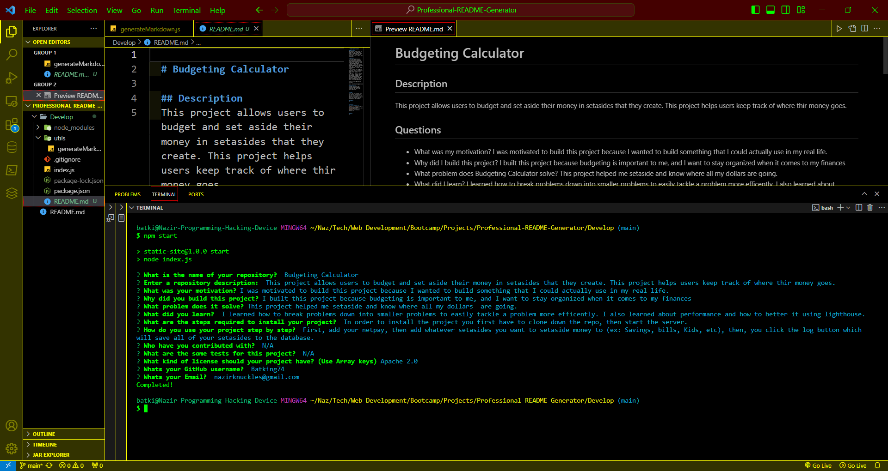

# Professional README Generator

# Description
Welcome To The README.Md Generator! This Command-Line Application Streamlines The Process Of Creating A Professional README For Your Projects. It Prompts You For Essential Information About Your Application, Such As A Project Title, Description, Installation Instructions, Usage Details, Contribution Guidelines, And Test Instructions. Choose A License From A List Of Options, And The Generator Will Automatically Add A Corresponding Badge And Notice To The README. Additionally, It Includes Sections For Questions, Providing Links To Your GitHub Profile And Contact Information.

- Motivation: Enhance personal project development process, Create a tool for efficient README file generation.

- Reason for Building: Expedite the creation of README files. Streamline and automate documentation tasks.

- What I Learned: Insights into workflow automation, Improved efficiency in project development, and Skill development in creating tools for streamlined tasks.

## Usage
To use the README.md Generator, follow these steps:

1. Open your terminal.

2. Navigate to the root directory of the develop folder.

3. Run the following command to start the generator: node index.js

4. Answer the prompted questions about your project, including the project title, description, installation instructions, usage details, contribution guidelines, and test instructions.

5. Choose a license from the provided options.

6. Once all questions are answered, the generator will automatically create a high-quality README.md file in your project's directory.

7. Review and customize the generated README as needed.

## Technologies Used
- JavaScript
- Node.js
- inquirer

GitHub Repo: https://github.com/Batking74/Professional-README-Generator
